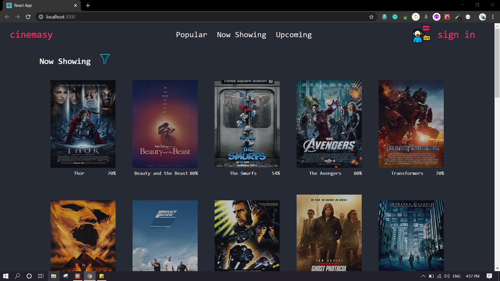
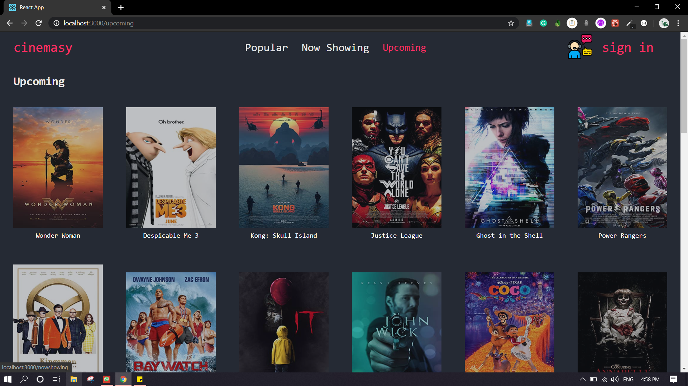
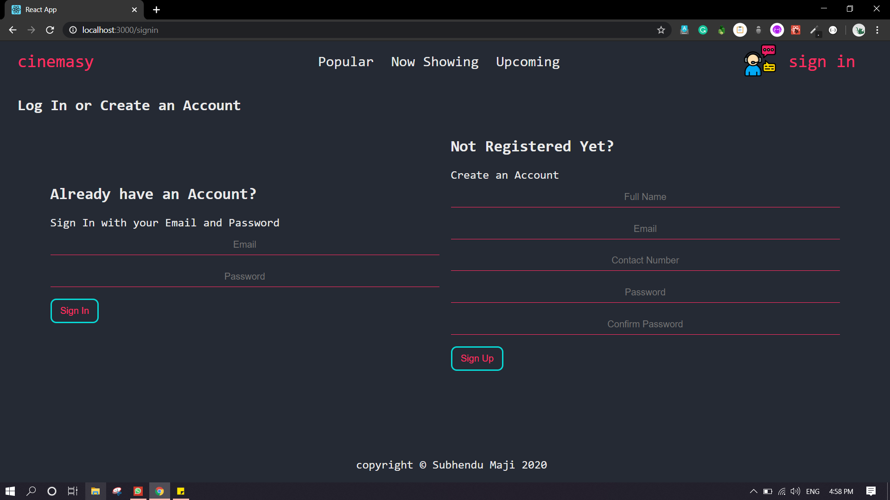
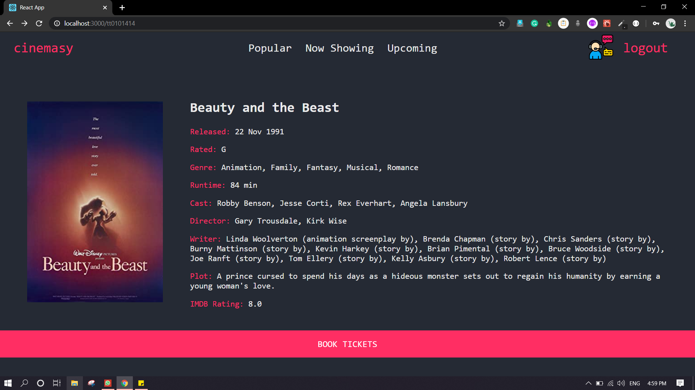
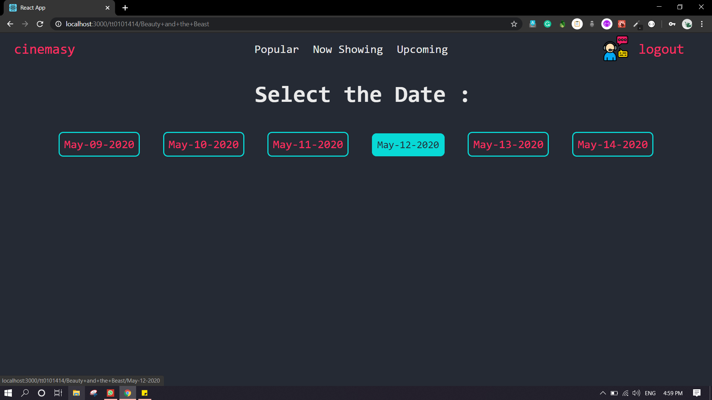
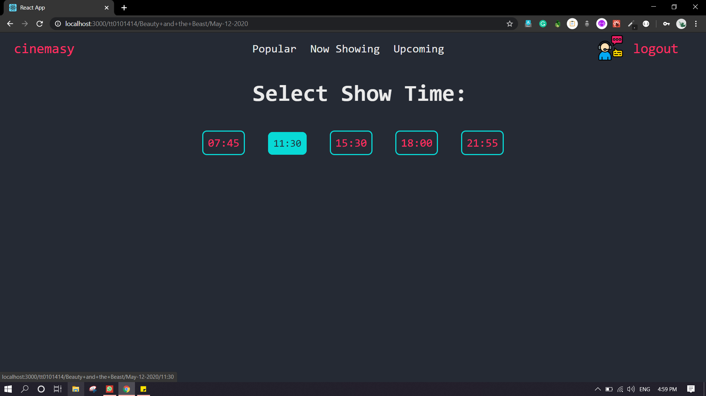
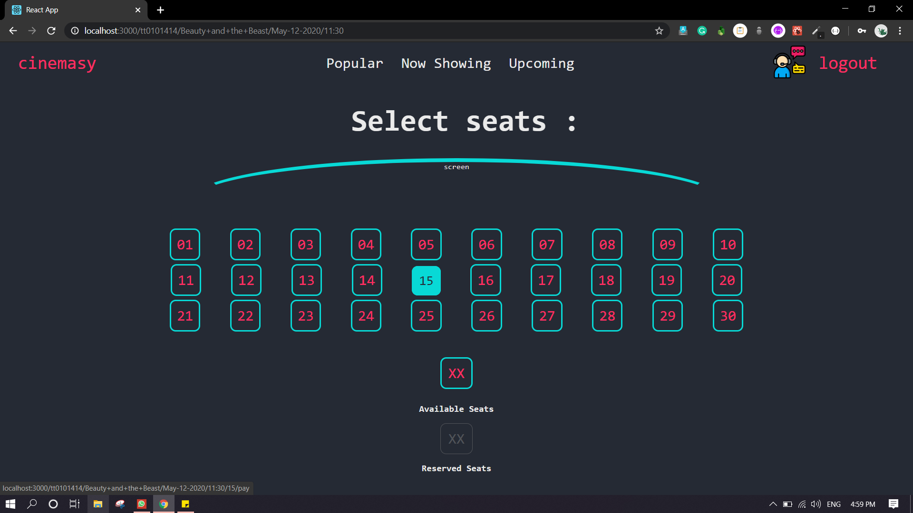
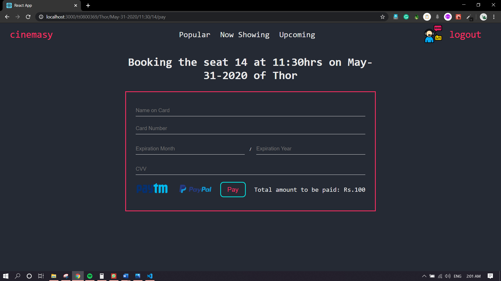
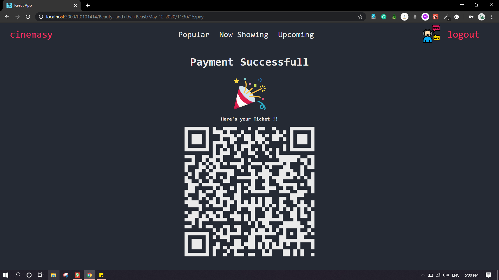
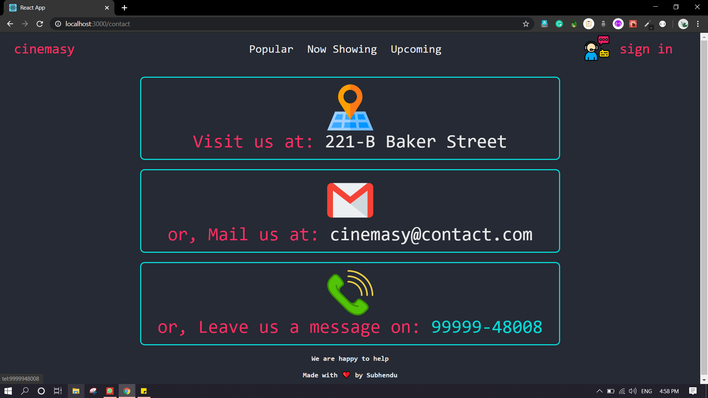

This is React Project for Movie Booking System.

#### Technologies used :

* React as Frontend Framework
* Express
* NodeJS
* MongoDB as Database

### To run this project:

1. Clone the repo `git clone`
2. run `npm install`
3. then `npm start`

#### The backend of this project is in separate repo i.e. Cinemasy-backend

* do the same steps as above

here's the screenshots.

#### landing page

#### upcoming page

#### Sign-In and Login Page

#### Description page 

#### Select Date Page

#### Select Show Time Page

#### Select Seat page

#### Pay Page

#### payment Successful - QR Code Generated

 

#### Contact Page

The booking history and users data are stored in MongoDB (offline):

* To view

  1. run `mongo`.(provided you have mongo already setup)

  2.  then run `use cinemasy`

  3. then ,

     1. for viewing user history

        * `db.users.find()`

     2. for viewing booking history

        * `db.bookings.find()`

          